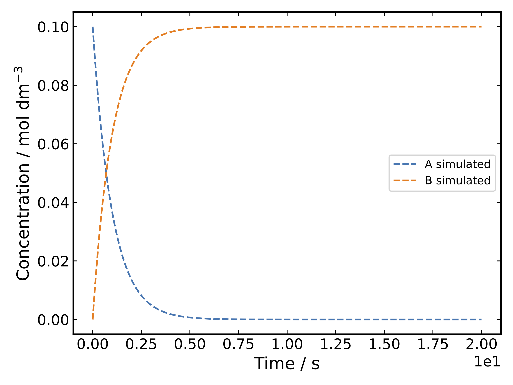

 [](https://opensource.org/licenses/MIT)


**rksim** generates time dependent concentrations for arbitrary 
reaction networks with irreversible and/or reversible reactions and enables
fitting rate constants to experimental data.

***
## Installation

If the requirements (numpy, scipy, networkx) are already satisfied:
```
pip install git+https://github.com/t-young31/rksim.git
```

***
## Usage
To simulate the kinetics of a simple A → B reaction

```python
from rksim import Reactant, Product, Reaction, System

rxn = Reaction(Reactant('A'), Product('B'),
               k=1.0)                         # s^-1

system = System(rxn)
system.set_initial_concentration('A', 0.1)    # mol dm-3
system.simulate(max_time=20)                  # s
system.plot()
```

<p align="center">
  
</p>

see [examples/](https://github.com/t-young31/rksim/tree/master/examples) for
a further examples.
